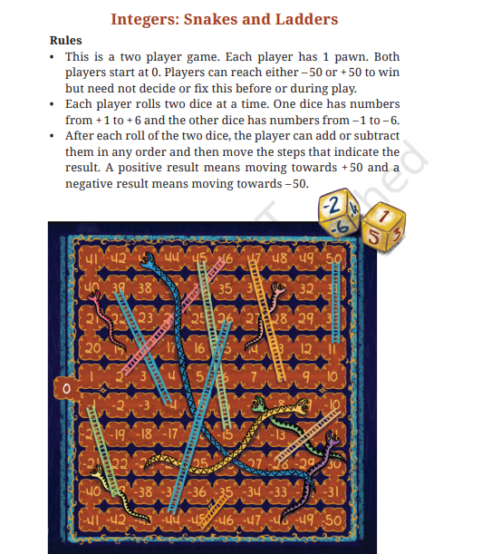

# Integers: Snakes & Ladders

An interactive game built to help students understand **integers** in a fun way.

This project is inspired by **Class 6 NCERT Maths — Chapter 10: *The Other Side of Zero***.

Instead of just solving problems on paper, this game lets students *experience* positive and negative numbers through movement on a board.

---

## 🎮 Play the Game

👉 [http://anchorapp.me/integers-snakes-ladders/](http://anchorapp.me/integers-snakes-ladders/)

---

## 🧠 What this teaches

- Positive and negative integers
- Movement on number line
- Addition and subtraction using gameplay
- Intuition behind "going below zero"

---

## ✨ Features

- Multiplayer mode (2 to 5 players)
- Vs AI mode
- Easy / Hard / Timer modes
- Interactive integer learning page for kids
- Rich themes, sound effects, and game animations
- Share-ready winner flow

---

## 🧰 Tech Stack

  
  
  
  
  

---

## 📬 Contact

- GitHub: [Shubham18024/integers-snakes-ladders](https://github.com/Shubham18024/integers-snakes-ladders)
- Email: [vaibhav.tiwari84478@gmail.com](mailto:vaibhav.tiwari84478@gmail.com)

---

## 🖼️ Reference (NCERT)

---

## 🕹️ Gameplay Preview

---

## 🤝 Contributing

Please read [CONTRIBUTING.md](CONTRIBUTING.md).

Main contribution ideas:

- Add more themes
- Add more educational mini-lessons
- Add more sound packs and accessibility improvements

---

## ⭐ Support

If you like this project, consider **starring the repo** — it helps a lot.

---

## 📜 License

This project is licensed under the MIT License. See [LICENSE](LICENSE).
